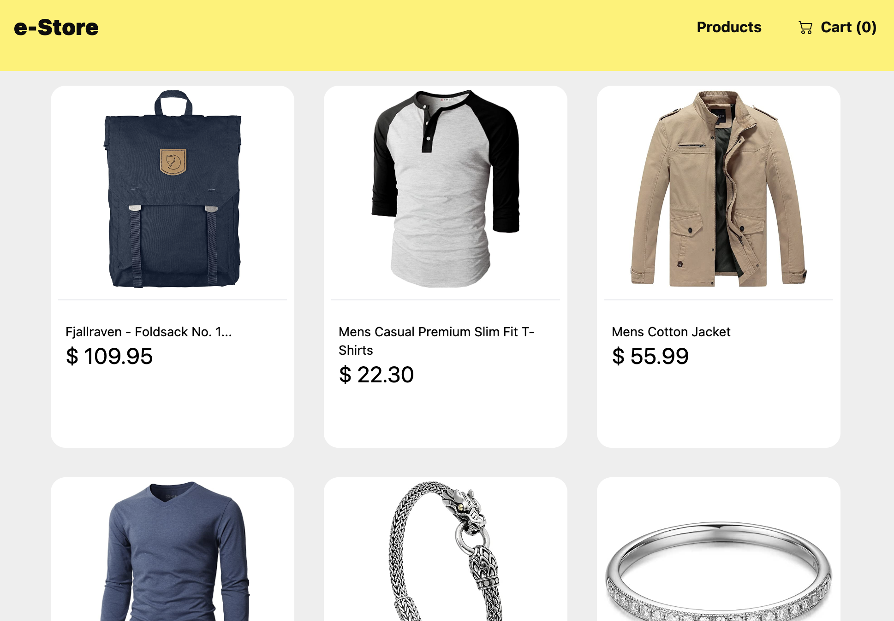
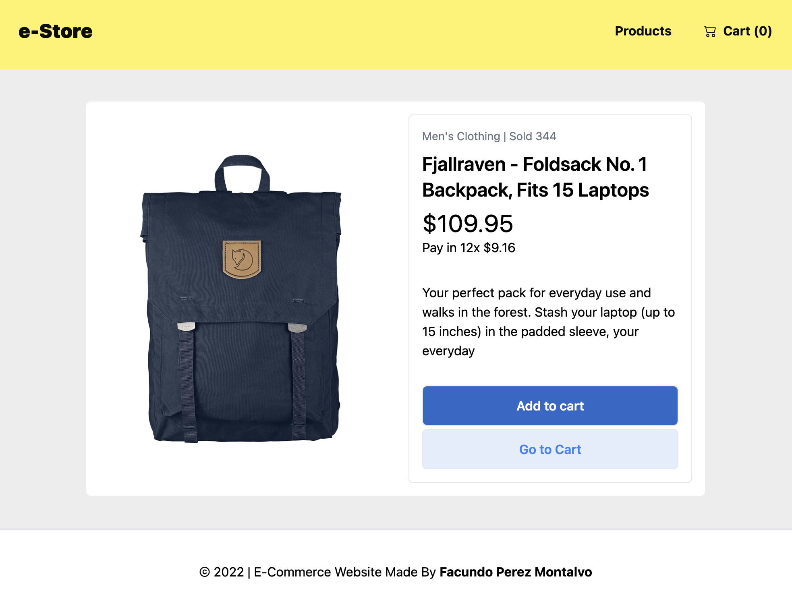

# e-Store

Ecommerce site to practice state managment. Built with best practices and styled with Tailwind CSS.

[Live site](https://e-store-facundo.vercel.app/)

## Screenshots

## Tech Stack

**Client:** React, Vite.js, useReducer, useContext, Tailwind CSS

**Deploy:** Vercel

## Acknowledgements

- [Tailwind CSS Docs](https://tailwindcss.com/docs/installation)

## Author

- [Facundo Perez Montalvo](https://facuperezm.vercel.app)

